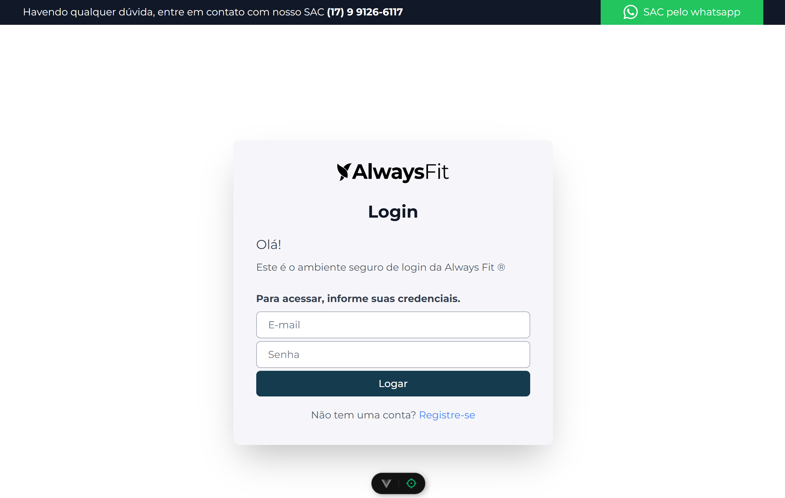
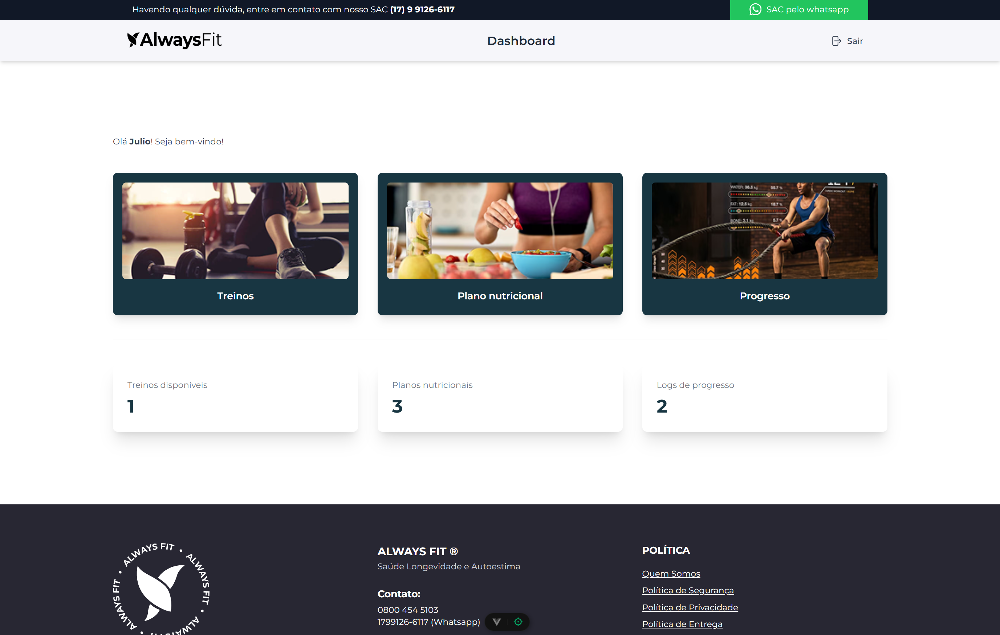
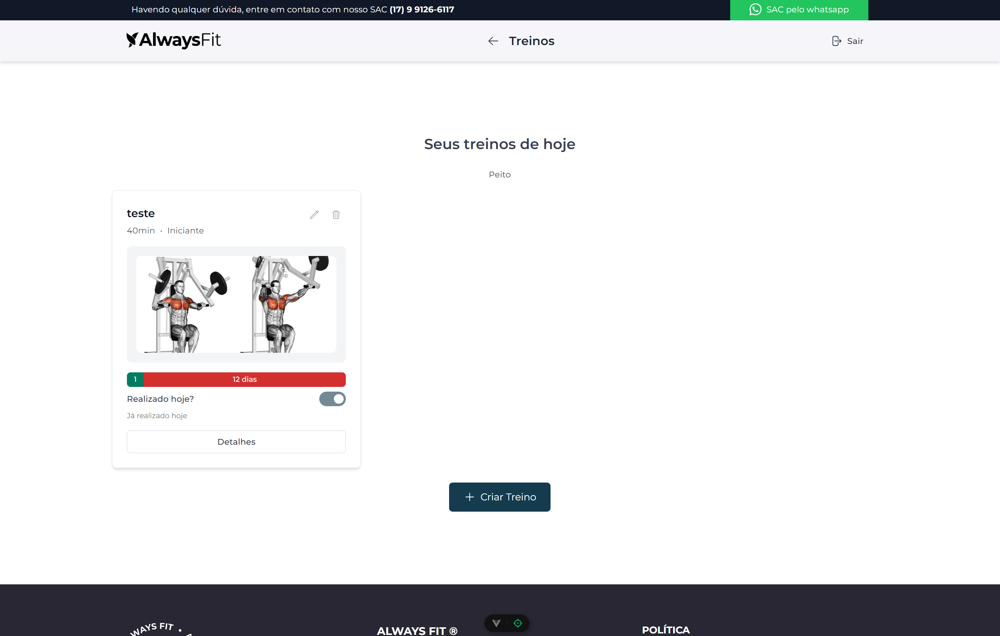
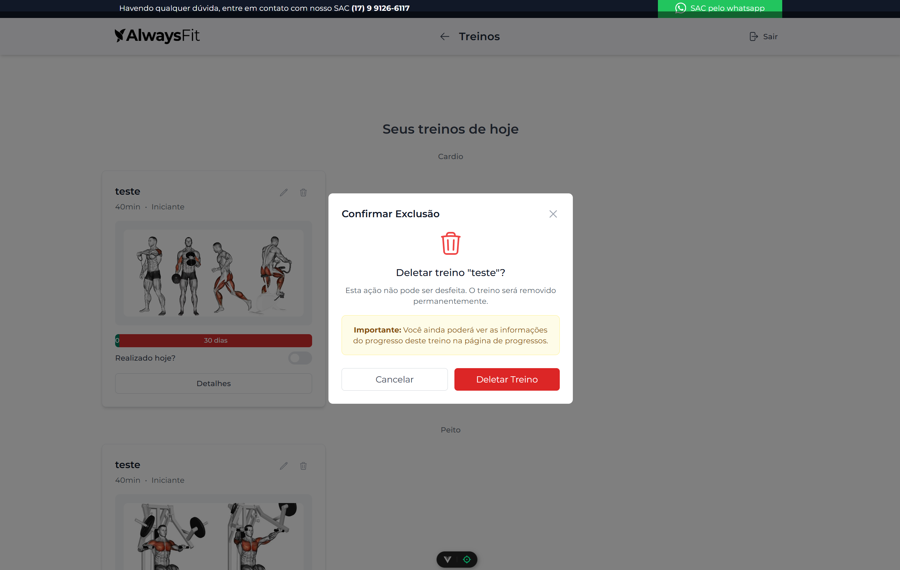
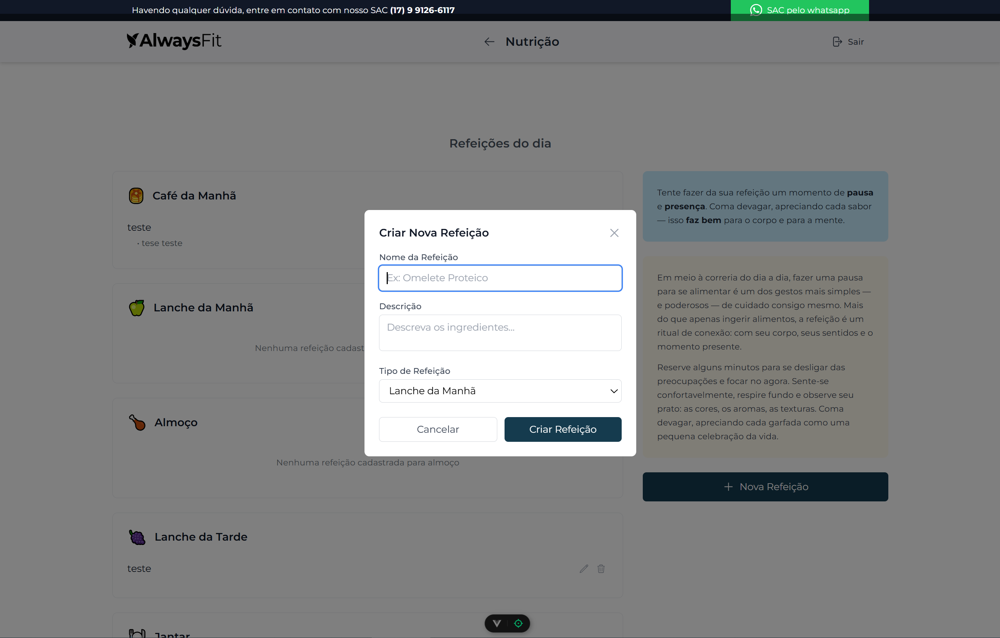
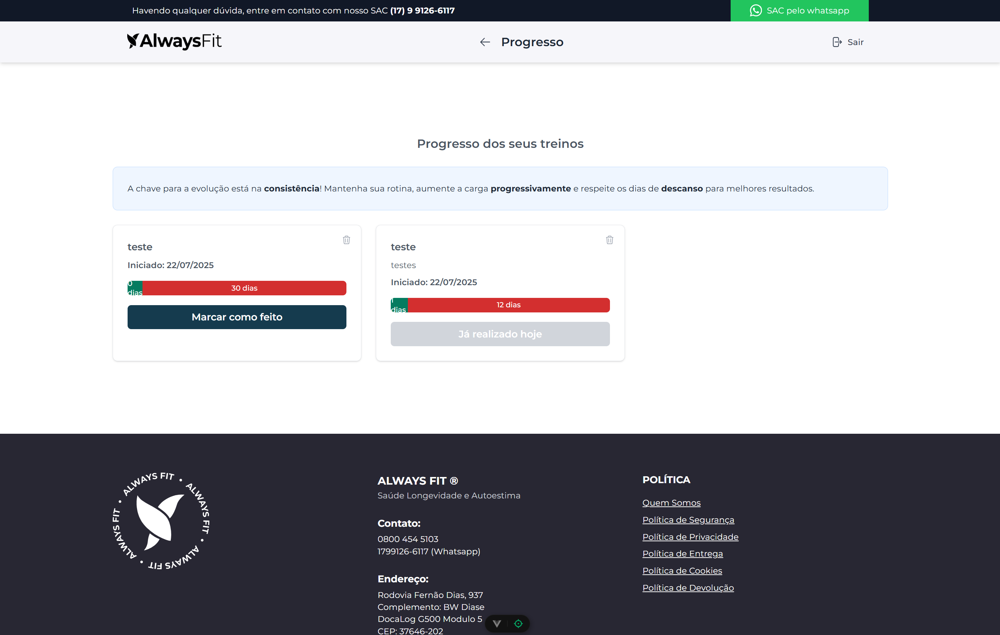

# desafio-always-fit

Este projeto utiliza Vue 3 + Vite para um sistema de gestão fitness.

## Principais Bibliotecas Utilizadas

- [Vue 3](https://vuejs.org/) — Framework principal
- [Vite](https://vitejs.dev/) — Bundler e dev server
- [Pinia](https://pinia.vuejs.org/) — State management
- [Vue Router](https://router.vuejs.org/) — Roteamento SPA
- [Heroicons](https://heroicons.com/) — Ícones SVG
- [@heroicons/vue](https://github.com/tailwindlabs/heroicons) — Ícones para Vue
- [Vue Toastification](https://github.com/Maronato/vue-toastification) — Toasts de feedback
- [Vitest](https://vitest.dev/) — Testes unitários
- [@vue/test-utils](https://test-utils.vuejs.org/) — Utilitários para testes de componentes Vue
- [Tailwind CSS](https://tailwindcss.com/) — Utilitário de CSS
- [Axios](https://axios-http.com/) — Requisições HTTP
- [ESLint](https://eslint.org/) — Linter de código
- [TypeScript](https://www.typescriptlang.org/) — Tipagem estática

## Fluxo de Uso do Sistema

1. **Acesso Inicial**
   - Ao acessar o sistema, o usuário é direcionado para a tela de login.
   - Caso não possua uma conta, pode clicar em "Registre-se" para criar um novo cadastro.
   
   

2. **Cadastro**
   - O usuário preenche nome, e-mail, senha e confirmação de senha.
   - Após o cadastro, uma mensagem de sucesso é exibida e o usuário pode realizar o login normalmente.

3. **Login**
   - O usuário informa e-mail e senha cadastrados.
   - Em caso de sucesso, é redirecionado para o dashboard principal.
   - Em caso de erro, um toast de erro é exibido.

4. **Dashboard**
   - Exibe um resumo dos principais dados: quantidade de treinos, planos nutricionais e logs de progresso.
   - O usuário pode navegar para as áreas de Treinos, Nutrição ou Progresso clicando nos respectivos cards.
   
   

5. **Treinos**
   - Visualização dos treinos do dia, separados por categoria.
   - Permite criar, editar, visualizar detalhes e deletar treinos.
   - É possível marcar progresso em cada treino.
   
   
   
   - Exemplo de exclusão de treino:
   
   

6. **Nutrição**
   - Visualização dos planos nutricionais do dia, separados por tipo de refeição.
   - Permite criar, editar, visualizar detalhes e deletar planos nutricionais.
   
   - Exemplo de criação de plano nutricional:
   
   

7. **Progresso**
   - Exibe o histórico de progresso dos treinos.
   - Permite deletar logs de progresso.
   
   

8. **Autenticação e Segurança**
   - O sistema utiliza tokens JWT e refresh token para manter o usuário autenticado.
   - O token é renovado automaticamente a cada mudança de rota, garantindo segurança e persistência da sessão.
   - Ao deslogar, todos os dados sensíveis são removidos do navegador.

9. **Feedback ao Usuário**
   - Toasts de sucesso e erro são exibidos para todas as principais ações (login, cadastro, criação/edição/deleção de itens).

10. **Logout**
    - O usuário pode sair do sistema a qualquer momento pelo botão "Sair" no topo da tela.

## Recommended IDE Setup

[VSCode](https://code.visualstudio.com/) + [Volar](https://marketplace.visualstudio.com/items?itemName=Vue.volar) (and disable Vetur).

## Type Support for `.vue` Imports in TS

TypeScript cannot handle type information for `.vue` imports by default, so we replace the `tsc` CLI with `vue-tsc` for type checking. In editors, we need [Volar](https://marketplace.visualstudio.com/items?itemName=Vue.volar) to make the TypeScript language service aware of `.vue` types.

## Customize configuration

See [Vite Configuration Reference](https://vite.dev/config/).

## Project Setup

```sh
npm install
```

### Compile and Hot-Reload for Development

```sh
npm run dev
```

### Type-Check, Compile and Minify for Production

```sh
npm run build
```

### Run Unit Tests with [Vitest](https://vitest.dev/)

```sh
npm run test:unit
```

### Lint with [ESLint](https://eslint.org/)

```sh
npm run lint
```
